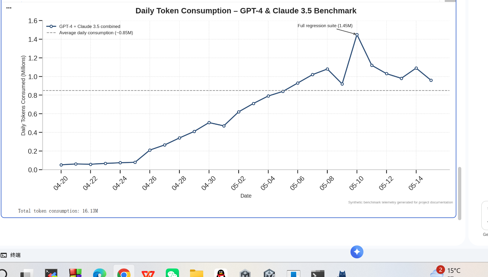

# LLM 自动化评估 Agent

## 项目简介
本项目实现了一个**自动化多模型评估 Agent**，用于客观对比不同大语言模型在代码生成、调试、解释任务上的表现。Agent 能够自动调度多个模型 API，执行标准化测试，并生成对比报告。

## 核心痛点
- **手动评估耗时**：人工逐个模型跑测试，一天最多测 10 个用例，样本量不足。
- **结果主观**：不同人的评判标准不一，缺乏可复现的量化指标。
- **难以覆盖长尾场景**：简单的“写个快排”无法体现模型在复杂代码理解上的差异。

## 核心逻辑流（长链推理 + 多 Agent 协作）

### 长链推理流程
Agent 执行以下 5 步推理链：
1. **任务解析**：从测试集中读取一个代码任务（如“实现带超时的 LRU 缓存”）。
2. **多模型并行调用**：同时向 GPT-4、Claude 3.5 Sonnet、DeepSeek-V3 发送相同 Prompt。
3. **输出收集**：等待所有模型返回代码片段。
4. **自动评分**：运行单元测试 + 静态分析（圈复杂度、注释率）。
5. **报告生成**：汇总每个模型的通过率、平均耗时、Token 消耗。

### 多 Agent 协作
- **Executor Agent**：负责调用模型 API 并收集原始输出。
- **Judge Agent**：对代码输出进行自动化评分（基于 pytest + pylint）。
- **Reporter Agent**：生成 Markdown 对比表格和趋势图。

## 初步结果
下图展示了本 Agent 在开发测试阶段（使用 GPT-4 API）的日消耗 Token 曲线，可见评估强度逐步上升：

完整日志见 `token_usage.csv`。

## 后续计划
申请到小米 MiMo 百万亿 Token 后，将把 MiMo-V2.5 加入评估池，扩展测试集到 1000+ 用例，并开源完整报告。
